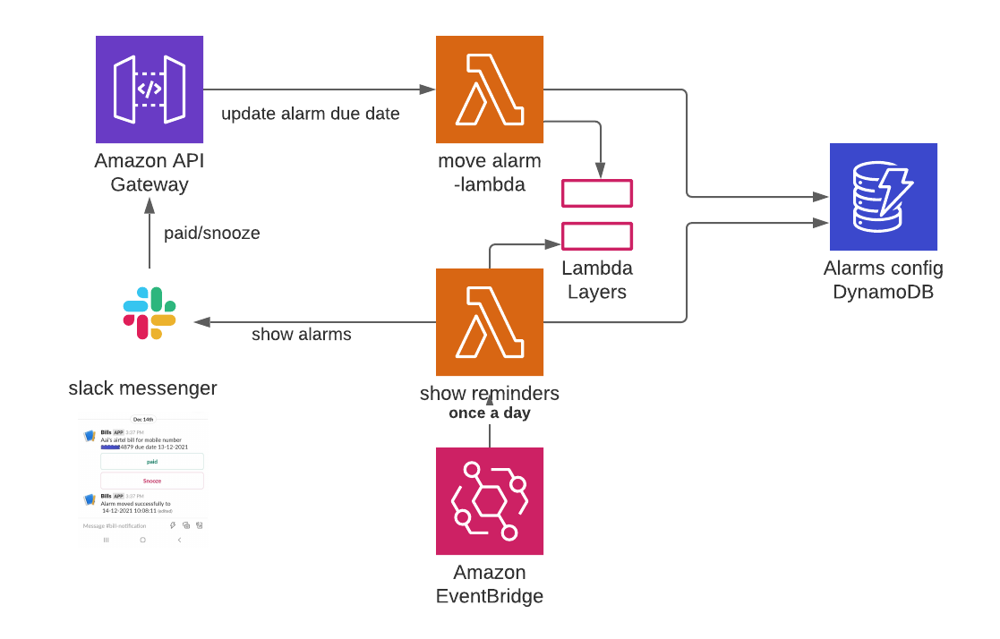

# Move reminders - lambda
AWS lambda application for handling user defined alarms. Acts in concert with reminders_serverless and lambda_layers repository
## introduction 
This repository is a AWS lambda package . Lambda handles the requests to either move the alarms as per alarm frequency ( Daily , Monthly , Yearly)
## context diagram

## Details 
Lambda is request handler . Request for moving reminders will come from slack messenger .
Currently lambda handles 2 actions for alarm perspective 
- move to the next frequency 
- snooze for the next day 
